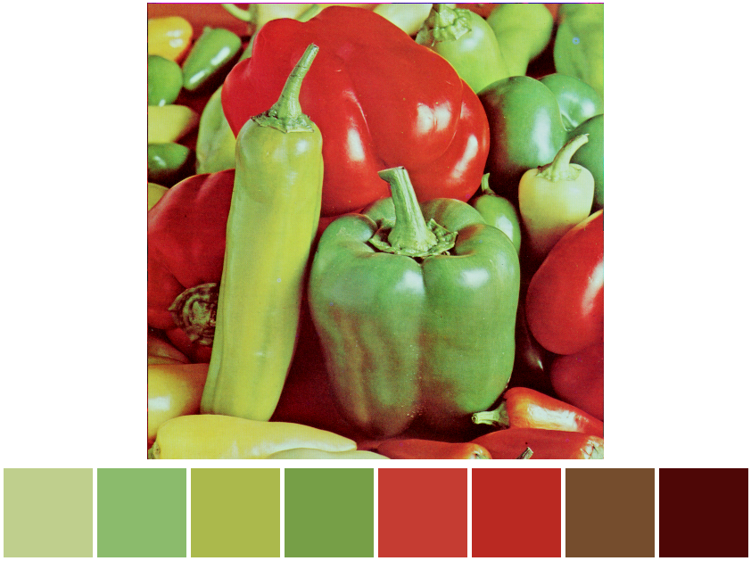

# iris-lib

[](https://github.com/Kaesebrot84/iris-lib/actions/workflows/ci.yml)

Generate color palettes from pixels or images using the [mediancut algorithm](https://en.wikipedia.org/wiki/Median_cut).

<p align="center">
    
</p>

## Usage

Include `iris-lib` in your Cargo.toml:

```toml
iris-lib = "0.1.0"
```

Create palettes from pixels:

```rust
use iris_lib::color_bucket::ColorBucket;
use iris_lib::color::Color;

fn main() {
    let colors = vec![
        Color { r: 255, g: 0, b: 0, a: 0 },
        Color { r: 0, g: 255, b: 0, a: 0 },
        Color { r: 0, g: 0, b: 255, a: 0 }
    ];

    if let Some(mut bucket) = ColorBucket::from_pixels(colors) {
        let palette = bucket.make_palette(3); // three iterations
        println!("{:?}", palette);
    };
}
```

Result:

```bash
[Color { r: 255, g: 0, b: 0, a: 0 }, 
 Color { r: 0, g: 255, b: 0, a: 0 }, 
 Color { r: 0, g: 0, b: 255, a: 0 }]
```

## Images

Include the `image` feature in your `Cargo.toml` reference.

```toml
iris-lib = { version = "0.1.0", features = ["image"]}
```

Create palettes by passing the path of the target image:

```rust
use iris_lib::color_bucket::ColorBucket;

fn main() {
    if let Some(mut bucket) = ColorBucket::from_image("peppers.png") {
        let palette = bucket.make_palette(2); // two iterations
        println!("{:?}", palette);
    };
}
```

Result:

```bash
[Color { r: 165, g: 197, b: 124, a: 255 }, 
 Color { r: 144, g: 172, b: 74, a: 255 }, 
 Color { r: 192, g: 51, b: 42, a: 255 }, 
 Color { r: 97, g: 42, b: 25, a: 255 }]
```

## Command line tool

Check out [iris](https://github.com/Kaesebrot84/iris) the command line tool built on top of this library.
